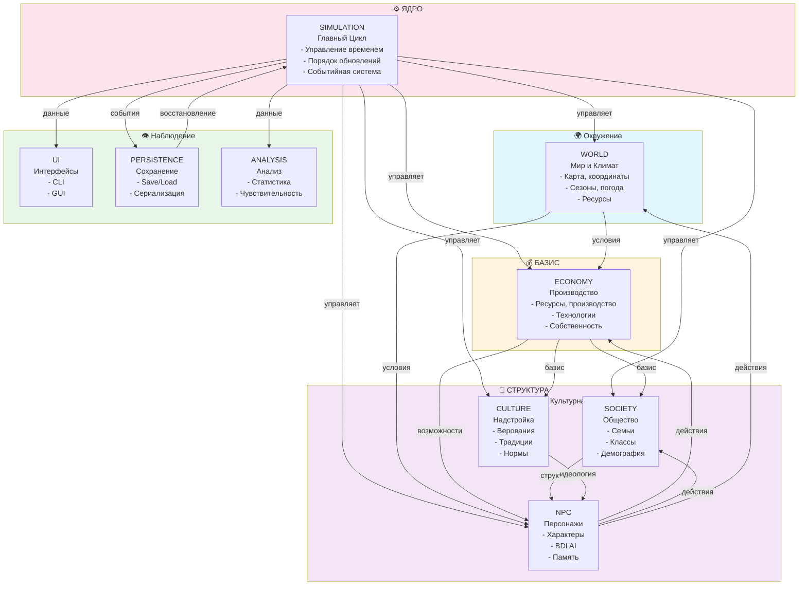
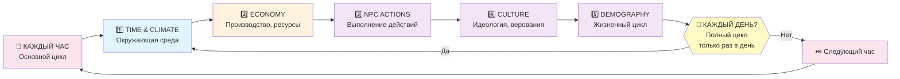
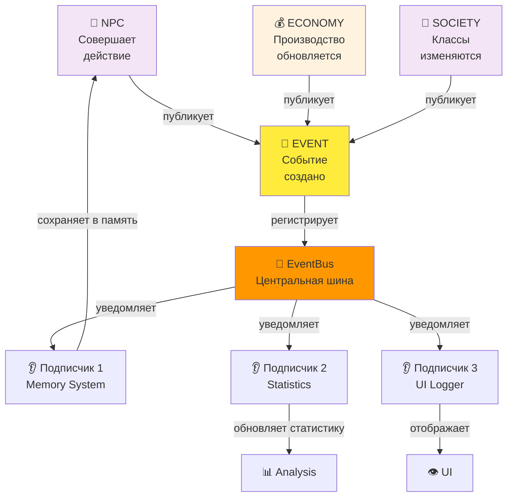
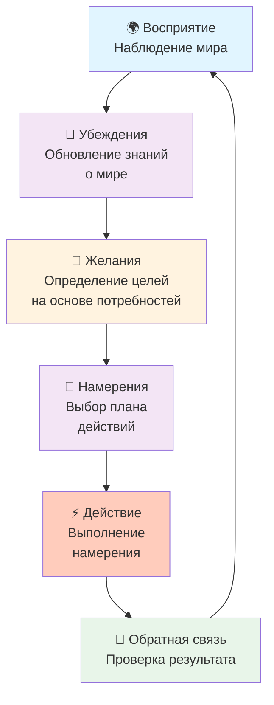

# Архитектурный Обзор Системы

## 1. Общее Описание

«Живой Мир» реализована как **монолитная симуляция на Python** с чётко разделёнными слоями и компонентами. Система построена на принципе **материалистического детерминизма**: экономический базис определяет социальную и культурную надстройку.

### Принцип Организации

```
ОКРУЖЕНИЕ (Мир)
  ↓
БАЗА/БАЗИС (Экономика)
  ↓
СТРУКТУРА (Общество, Культура, NPC)
  ↓
НАБЛЮДЕНИЕ (UI, Анализ)
```

---

## 2. Архитектурная Диаграмма

### 2.1 Система в Целом (Высокоуровневая Архитектура)



### 2.2 Внутренняя Структура Файлов

```
src/
│
├── core/                           # ⚙️ ЯДРО СИМУЛЯЦИИ
│   ├── simulation.py              # Главный цикл, порядок обновлений
│   ├── events.py                  # Система событий (EventBus, pub-sub)
│   ├── config.py                  # Конфигурация, presets
│   ├── consistency.py             # Проверки консистентности
│   ├── dialectics.py              # Анализ противоречий
│   └── emergence.py               # Отслеживание эмерджентных явлений
│
├── world/                          # 🌍 МИР И ОКРУЖЕНИЕ
│   ├── map.py                     # Карта, координатная система
│   ├── terrain.py                 # Типы местности
│   ├── climate.py                 # Климат, сезоны, катаклизмы
│   ├── location.py                # Локации
│   └── resources.py               # Распределение ресурсов
│
├── economy/                        # 💰 ЭКОНОМИЧЕСКИЙ БАЗИС
│   ├── production.py              # Производство, труд, SNLT
│   ├── property.py                # Собственность, классы
│   ├── technology.py              # Технологии, древо технологий
│   └── resources.py               # Материальные ресурсы
│
├── society/                        # 👥 СОЦИАЛЬНАЯ СТРУКТУРА
│   ├── family.py                  # Семьи, родство
│   ├── classes.py                 # Классовая система, сознание
│   └── demography.py              # Демография, жизненный цикл
│
├── culture/                        # 🎭 КУЛЬТУРНАЯ НАДСТРОЙКА
│   ├── beliefs.py                 # Верования, идеология
│   ├── traditions.py              # Традиции, ритуалы
│   └── norms.py                   # Социальные нормы
│
├── npc/                            # 🤖 ПЕРСОНАЖИ И AI
│   ├── character.py               # Основной класс NPC
│   ├── genetics.py                # Генетика, наследование
│   ├── memory.py                  # Система памяти (Memory Stream)
│   ├── personality.py             # Черты характера, личность
│   ├── needs.py                   # Потребности (Maslow-like)
│   └── ai/
│       └── bdi.py                 # BDI-архитектура (Beliefs, Desires, Intentions)
│
├── ui/                             # 👁️ ПОЛЬЗОВАТЕЛЬСКИЙ ИНТЕРФЕЙС
│   ├── cli_ui.py                  # Интерфейс командной строки
│   ├── graphics.py                # Графический движок (pygame-ce)
│   └── renderers.py               # Рендеринг компонентов
│
├── persistence/                    # 💾 СОХРАНЕНИЕ И ЗАГРУЗКА
│   ├── save_system.py             # Сохранение состояния
│   ├── load_system.py             # Загрузка состояния
│   └── serializers.py             # Сериализаторы объектов
│
└── analysis/                       # 📊 АНАЛИЗ И ИССЛЕДОВАНИЕ
    ├── statistics.py              # Статистика по системам
    ├── sensitivity.py             # Анализ чувствительности
    └── patterns.py                # Выявление паттернов
```

---

## 3. Цикл Симуляции

### 3.1 Порядок Обновления (главный симуляционный цикл)

Симуляция использует **многоуровневую иерархию времени** с различными частотами обновления:



### 3.2 Подробное Описание Каждого Этапа

#### **Этап 1: ВРЕМЯ И КЛИМАТ** (TIME & CLIMATE)
*Окружающая среда, основание для всех других процессов*

**Выполняется**: Каждый час (часть основного цикла)

**Действия**:
- Продвижение игрового времени на 1 час
- Отслеживание дней, месяцев, лет
- Один раз в день (каждый 24-й час):
  - Обновление климата (сезоны, погода)
  - Проверка катаклизмов (засуха, чума, наводнение)

**Важность**: Климат является базовым условием, влияющим на все остальные системы (производство, здоровье, миграцию)

```python
# Псевдокод
def update_time():
    hours += 1
    if hours % 24 == 0:  # один раз в день
        days += 1
        update_climate()
        publish_event(DAY_PASSED)
    if days % 30 == 0:   # один раз в месяц
        months += 1
        publish_event(MONTH_PASSED)
    if months % 12 == 0: # один раз в год
        years += 1
        publish_event(YEAR_PASSED)
```

---

#### **Этап 2: ЭКОНОМИКА** (ECONOMY)
*Базис: производство, ресурсы, собственность*

**Выполняется**: Каждый час (основные расчёты), один раз в день (классовые отношения)

**Действия**:
- Расчёт производства (влияние климата на урожай)
- Отслеживание ресурсов и избыточного продукта
- Один раз в день:
  - Пересчёт классовой структуры
  - Обновление отношений собственности
  - Расчёт эксплуатации и излишков

**Математика**:
```
Произведённая стоимость = Труд NPC × Технология × Условия климата
Необходимый продукт = Потребление для выживания
Избыточный продукт = Произведённая стоимость - Необходимый продукт
Норма эксплуатации (m') = Избыточный продукт / Необходимый продукт
```

**Философия**: Экономический базис определяет возможности для всех других систем

---

#### **Этап 3: ДЕЙСТВИЯ NPC** (NPC ACTIONS)
*Агентство в экономической структуре*

**Выполняется**: Каждый час

**Цикл BDI**:
```
Восприятие → Обновление убеждений → Формирование желаний →
Выбор намерений → Выполнение действия → Обновление мира
```

**Возможные действия**:
- Собирательство (сбор ресурсов из окружения)
- Охота (добыча животных)
- Ремесло (создание инструментов и предметов)
- Земледелие (обработка земли)
- Торговля (обмен с другими NPC)
- Отдых (восстановление здоровья и энергии)
- Семейные действия (рождение, воспитание)

**Решения принимаются на основе**:
- Экономического положения (класс, ресурсы, собственность)
- Потребностей (голод, усталость, социальные нужды)
- Верований и идеологии
- Личных черт (смелость, жадность, доброта)
- Воспоминаний о прошлых действиях

---

#### **Этап 4: КУЛЬТУРА** (CULTURE)
*Надстройка: верования, традиции, идеология*

**Выполняется**: Один раз в день

**Действия**:
- Обновление верований (на основе экономических условий и событий)
- Распространение традиций
- Формирование социальных норм
- Развитие классового сознания

**Философия**: Культура и идеология **возникают** из экономических условий, а не навязываются сверху

**Пример течения**:
```
Экономические отношения (землевладельцы vs крестьяне)
    ↓
Социальные отношения (неравенство, зависимость)
    ↓
Идеологические верования ("боги награждают благородство", "судьба")
    ↓
Социальные нормы (почтение к вышестоящим, покорность)
```

---

#### **Этап 5: ДЕМОГРАФИЯ** (DEMOGRAPHY)
*Жизненный цикл, воспроизводство населения*

**Выполняется**: Один раз в день

**Процессы**:
- Старение NPC (увеличение возраста на 1 день)
- Рождение детей (вероятность на основе возраста и ресурсов)
- Смерть от старости (проверка жизненного цикла)
- Смерть от голода (недостаток пищи)
- Смерть от болезней (эпидемии)

**Жизненные этапы**:
```
0-2:   Младенец   (высокая смертность, зависимость)
3-12:  Ребёнок    (развитие, обучение)
13-17: Подросток  (взросление, выбор профессии)
18-30: Молодой    (репродуктивный пик, активность)
31-50: Взрослый   (стабильность, опыт)
51-65: Зрелый     (мудрость, снижение активности)
66+:   Старик     (высокая смертность)
```

---

### 3.3 Временная Иерархия

```
1 Час
├── Основной цикл (выполняется каждый час)
│   ├── TIME: Продвижение времени
│   ├── ECONOMY: Основные расчёты производства
│   └── NPC ACTIONS: Выполнение действий
│
└── Ежедневные процессы (выполняются раз в 24 часа)
    ├── CLIMATE: Обновление климата
    ├── ECONOMY: Классовые отношения
    ├── CULTURE: Идеология и верования
    └── DEMOGRAPHY: Рождения, смерти

1 Месяц = 30 дней
├── Событие: MONTH_PASSED

1 Год = 12 месяцев
├── Событие: YEAR_PASSED
├── Поколение = ~25 лет (событие: GENERATION_PASSED)
```

---

## 4. Система Событий (EventBus)

### 4.1 Архитектура Pub-Sub

Система использует **издатель-подписчик паттерн** для слабой связанности компонентов:



### 4.2 Типы Событий (24 категории)

| Категория | Типы | Примеры |
|-----------|------|---------|
| **Жизненный цикл** | NPC_BORN, NPC_DIED, NPC_AGED | Рождение ребёнка, смерть от болезни |
| **Семья** | MARRIAGE, DIVORCE, CHILD_BORN | Свадьба, развод, рождение наследника |
| **Экономика** | RESOURCE_GATHERED, TRADE_COMPLETED, ITEM_CRAFTED | Сбор пшеницы, торговля, изготовление топора |
| **Собственность** | PROPERTY_CLAIMED, PROPERTY_TRANSFERRED, PROPERTY_LOST | Захват земли, наследование имущества |
| **Технология** | TECHNOLOGY_DISCOVERED, KNOWLEDGE_TRANSFERRED, TOOL_CREATED | Открытие земледелия, обучение сыном отца |
| **Социум** | CLASS_EMERGED, CONFLICT_STARTED, CONSCIOUSNESS_SPREAD | Возникновение класса рабов, революция |
| **Культура** | BELIEF_FORMED, TRADITION_CREATED, RITUAL_PERFORMED | Возникновение религии, праздник урожая |
| **Климат** | SEASON_CHANGED, DROUGHT, PLAGUE, FAMINE | Начало весны, засуха, эпидемия |
| **Время** | DAY_PASSED, MONTH_PASSED, YEAR_PASSED, GENERATION_PASSED | Завершение дня, столетие |

### 4.3 Уровни Важности Событий

```
1. TRIVIAL     (тривиальное)    - повседневные действия (сбор ягод, сон)
2. MINOR       (незначительное) - рутинные события (обычная охота)
3. NOTABLE     (заметное)       - важные события (рождение ребёнка)
4. IMPORTANT   (важное)         - значимые события (открытие технологии)
5. MAJOR       (крупное)        - поворотные события (возникновение класса)
6. HISTORIC    (историческое)   - эпохальные события (революция)
```

**Использование**: События HISTORIC уровня сохраняются навсегда, тривиальные события могут быть удалены при переполнении истории (макс. 10,000 событий).

---

## 5. Потоки Данных Между Системами

### 5.1 От Мира к NPC

```
WORLD (Климат, ресурсы)
    ↓
PERCEPTION (восприятие)
    ↓
NPC BELIEFS (убеждения о мире)
    ↓
DESIRES (желания на основе потребностей)
    ↓
INTENTIONS (выбор действия)
    ↓
ACTIONS (сбор ресурсов, переезд, охота)
```

**Пример**: Засуха → нет ягод → голод → отчаяние → мигрировать в другую локацию

### 5.2 От Экономики к Обществу и Культуре

```
PRODUCTION (производство)
    ↓
SURPLUS (избыточный продукт)
    ↓
PROPERTY (возникает собственность)
    ↓
CLASSES (появляются классы: владельцы vs работники)
    ↓
CLASS_CONSCIOUSNESS (осознание класса)
    ↓
CULTURE & BELIEFS (идеология для оправдания)
    ↓
SOCIAL_NORMS (нормы подчинения/господства)
```

**Пример**: Земледелие → избыток зерна → захват земли → рабовладение → верование в неравенство → законы о классах

### 5.3 От NPC действий к Обществу

```
NPC ACTIONS
    ├─→ Работа в поле → PRODUCTION
    ├─→ Захват земли → PROPERTY CLAIMS
    ├─→ Рождение детей → FAMILY, DEMOGRAPHY
    ├─→ Обучение других → TECHNOLOGY SPREAD
    └─→ Распространение верований → CULTURE
            ↓
        SOCIETY CHANGES
            ↓
        NEXT CYCLE (влияет на других NPC)
```

### 5.4 Обратная связь (Циклы)

```
                    ┌─ Верования влияют на поведение NPC
                    │
                    ▼
Экономика → Общество → Культура
    ▲                     │
    │                     │
    └─ Идеология определяет, какие технологии приемлемы
    └─ Верования влияют на готовность работать
    └─ Нормы определяют семейную структуру и демографию
```

**Циклическая природа**: Изменения экономики влияют на культуру, которая затем влияет на социальное поведение, которое создаёт новые экономические условия.

---

## 6. Архитектурные Слои

### 6.1 Слой Моделирования (Core Simulation)

```
┌────────────────────────────────────────┐
│  SIMULATION ENGINE                     │
│  ├─ Time Management                    │
│  ├─ Update Orchestration               │
│  └─ Event Publishing                   │
└────────────────────────────────────────┘
           ↓
┌────────────────────────────────────────┐
│  WORLD LAYER                           │
│  ├─ Map & Coordinates                  │
│  ├─ Resources & Terrain                │
│  ├─ Climate & Seasons                  │
│  └─ Catastrophes                       │
└────────────────────────────────────────┘
           ↓
┌────────────────────────────────────────┐
│  BASIS LAYER (Economic Foundation)     │
│  ├─ Production                         │
│  ├─ Technology                         │
│  ├─ Property & Ownership               │
│  └─ Resource Distribution              │
└────────────────────────────────────────┘
           ↓
┌────────────────────────────────────────┐
│  SOCIETY & CULTURE LAYER               │
│  ├─ Family & Kinship                   │
│  ├─ Class Structure                    │
│  ├─ Beliefs & Ideology                 │
│  ├─ Traditions & Norms                 │
│  └─ Class Consciousness                │
└────────────────────────────────────────┘
           ↓
┌────────────────────────────────────────┐
│  AGENCY LAYER (NPC AI)                 │
│  ├─ BDI Decision Making                │
│  ├─ Memory & Learning                  │
│  ├─ Personality & Traits               │
│  └─ Action Execution                   │
└────────────────────────────────────────┘
           ↓
┌────────────────────────────────────────┐
│  OBSERVATION LAYER                     │
│  ├─ UI (CLI, GUI)                      │
│  ├─ Save/Load System                   │
│  └─ Statistics & Analysis              │
└────────────────────────────────────────┘
```

### 6.2 Зависимости между Слоями

```
Observation → ← (читает состояние)
    ↑
Perception ← ← (наблюдает события)
    ↑
Agency (NPC) ← ← (принимает решения)
    ↑
Society & Culture ← ← (определяет нормы и желания)
    ↑
Basis (Economy) ← ← (задаёт возможности)
    ↑
World ← ← (предоставляет условия)
```

---

## 7. BDI-Архитектура NPC

### 7.1 Цикл Принятия Решений



### 7.2 Потоки Данных BDI

```
PERCEPTION LAYER
  └─ Senses: vision (локальная область), memory (воспоминания), communication (слова от других)

BELIEF UPDATES
  ├─ World beliefs (где ресурсы, кто враг, куда идти)
  ├─ Social beliefs (кто друг, социальная иерархия)
  └─ Ideological beliefs (мораль, законность)

DESIRE FORMATION
  ├─ Physical needs (голод, усталость, здоровье)
  ├─ Social needs (семья, статус, принадлежность)
  └─ Ideological needs (справедливость, честь)

INTENTION SELECTION
  └─ Practical reasoning (means-end reasoning, GOAP)
      ├─ Какие действия приведут к цели?
      ├─ Какие ресурсы нужны?
      └─ Каков риск?

ACTION EXECUTION
  ├─ Movement (сбор ресурсов, переезд)
  ├─ Production (ремесло, земледелие)
  ├─ Social (торговля, общение)
  └─ Reproduction (семья, наследование)

MEMORY STREAM
  └─ Record: что произошло, когда, с кем
```

---

## 8. Текущее Состояние vs Планируемое Состояние

### 8.1 Текущее Состояние (As-Is)

#### ✅ Что работает:
- Основной симуляционный цикл (TIME → ECONOMY → NPC → CULTURE → DEMOGRAPHY)
- Система событий EventBus с 24 типами событий
- Базовое производство и распределение ресурсов
- Простая демография (рождения, смерти)
- Базовая BDI-архитектура (восприятие → желания → действия)
- Генеративные агенты с системой памяти
- Основные технологии и их открытие

#### ⚠️ Ограничения:
- Классовое сознание неполное (INT-021 БЛОКЕР)
- Экономика без трудовой теории стоимости (ECON-001)
- SNLT (социально необходимое рабочее время) не реализовано (ECON-002)
- Нет средств-целевого рассуждения в BDI (AI-005)
- Намерения NPC не персистентны (AI-001)
- Эмергентность классов и сознания ограничена
- Визуализация отсутствует (только логирование)

### 8.2 Планируемое Состояние (To-Be)

Из **Task 002** выявлены **197 проблем**, организованные в 6 EPIC по приоритету:

#### Tier 0: EPIC-INTEGRATION (INT-xxx) - Архитектурные блокеры
- INT-021: Унификация NPC моделей
- INT-020: Активация EventBus системы
- INT-022: Consistency validation checks

#### Tier 1: EPIC-ECONOMY (ECON-xxx) - Экономический фундамент
- ECON-001: Трудовая теория стоимости (LTV)
- ECON-002: Социально необходимое рабочее время (SNLT)
- ECON-003+: Формирование цен на рынке, торговля, первоначальное накопление

#### Tier 2: EPIC-SUPERSTRUCTURE (SUP-xxx) - Культура и идеология
- SUP-001: Полная система классового сознания
- SUP-002: Гегемония (по Грамши)
- SUP-003+: Революции, восстания, органические интеллектуалы

#### Tier 3: EPIC-SOCIAL (SOC-xxx) - Социальное воспроизводство
- Улучшенная демография
- Система образования и передачи знаний
- Наследование и социальная мобильность

#### Tier 4: EPIC-WORLD (WORLD-xxx) - Мировая система
- Пространственная интеграция локаций
- Торговля между селениями
- Миграция населения

#### Tier 5: EPIC-AI (AI-xxx) - Системы AI
- AI-001: Персистентные намерения
- AI-005: Means-end reasoning (GOAP)
- AI-006+: Эмоции, социальная память, коллективное поведение

**Временная шкала**: ~26 недель (~6 месяцев) для полной реализации всех улучшений.

---

## 9. Ключевые Архитектурные Принципы

### 9.1 Марксистский материализм

```
Экономический базис
(производительные силы + производственные отношения)
        ↓ определяет
    Надстройка
(политика, культура, идеология, право)
```

**Реализация в коде**:
- Экономический слой обновляется ПЕРЕД культурным
- Классы возникают из отношений собственности
- Идеология оправдывает существующие экономические отношения
- Технологии открываются через практику (труд)

### 9.2 Эмерджентность

Всё возникает из локального взаимодействия:
- **Классы** возникают из различий в собственности (не задаются заранее)
- **Культура** формируется из повседневной жизни (а не насаждается сверху)
- **Нормы** появляются из социального взаимодействия
- **Технология** открывается через опыт (не добавляется в игру)

### 9.3 Агентный Подход

- Каждый NPC - автономный агент с собственной BDI логикой
- Решения принимаются локально, без глобального контроля
- Коллективное поведение возникает из агентных взаимодействий
- Система допускает разнообразие (каждый NPC уникален)

### 9.4 Событийная Архитектура

- Слабая связанность компонентов через EventBus
- История мира записывается через события
- Возможность "перемотки" через воспроизведение событий
- Аналитика через анализ последовательности событий

### 9.5 Многоуровневость

```
Микро:  Индивидуальный NPC (его решения, память, личность)
Мезо:   Семья, соседство (локальные взаимодействия)
Макро:  Общество, классы, культура (общесистемные паттерны)
```

Каждый уровень имеет свою логику, но влияет на другие.

---

## 10. Интеграция Компонентов

### 10.1 Пример: Возникновение Частной Собственности

```
1. ЭКОНОМИКА (Basis)
   Хороший урожай → избыток ресурсов
       ↓
2. ОБЩЕСТВО (Society)
   NPC накапливает больше земли → возникает неравенство
       ↓
3. КУЛЬТУРА (Culture)
   Идеология меняется → "земля может быть чей-то"
       ↓
4. NPC ДЕЙСТВИЯ
   Стремление к земле становится нормой
       ↓
5. ДЕМОГРАФИЯ
   Дети наследуют землю → установление династий
       ↓
6. (Цикл повторяется, разрыв ещё больше)
```

### 10.2 Пример: Классовый Конфликт

```
1. ЭКОНОМИКА
   Часть NPC владеет землей, часть нет
       ↓
2. ОБЩЕСТВО
   Классовая структура формируется (рабовладельцы vs рабы)
       ↓
3. КУЛЬТУРА
   Противоречивые верования (рабовладельцы верят в превосходство)
       ↓
4. NPC ДЕЙСТВИЯ
   Взаимное недовольство, восстания, подавление
       ↓
5. СОБЫТИЯ
   CONFLICT_STARTED, REBELLION, CONSCIOUSNESS_SPREAD
       ↓
6. НОВАЯ ЭКОНОМИКА
   Победа одного класса или новое равновесие
```

---

## 11. Развёртывание и Конфигурация

### 11.1 Точки Входа

```
Python 3.10+
    ├─ main.py           # CLI режим (без зависимостей)
    │  └─ Отправной код
    │
    └─ main_gui.py       # GUI режим (требует pygame-ce)
       └─ Отправной код с графикой
```

### 11.2 Конфигурационные Presets

```python
Config.PRESET_REALISTIC   # Реалистичная скорость (медленная эволюция)
Config.PRESET_ACCELERATED # Ускоренная (для быстрого наблюдения)
Config.PRESET_SANDBOX     # Песочница (без катаклизмов, быстрая)
```

---

## 12. Заключение

Архитектура «Живого Мира» реализует **материалистический взгляд на социальную эволюцию**:

1. **Базис** (экономика) как фундамент всего
2. **Агентство** (NPC с BDI) как механизм реализации
3. **Эмерджентность** (классы, культура, технология возникают)
4. **События** (история мира записывается объективно)
5. **Циклы** (противоречия и обратная связь)

Эта архитектура позволяет создавать **живые миры**, где исторические процессы развёртываются естественным образом, без сценариев.

---

## Ссылки на Другие Документы

- [1_INTRODUCTION.md](./1_INTRODUCTION.md) - Философия и основания проекта
- [3_SIMULATION_CORE.md](./3_SIMULATION_CORE.md) - Детальное описание цикла симуляции
- [4_ECONOMIC_SYSTEM.md](./4_ECONOMIC_SYSTEM.md) - Экономический базис
- [5_SOCIETY_SYSTEM.md](./5_SOCIETY_SYSTEM.md) - Социальная структура
- [6_CULTURE_SYSTEM.md](./6_CULTURE_SYSTEM.md) - Культурная надстройка
- [7_NPC_SYSTEM.md](./7_NPC_SYSTEM.md) - NPC и BDI-архитектура
- [8_WORLD_ENVIRONMENT.md](./8_WORLD_ENVIRONMENT.md) - Мир и окружение
- [DOCUMENTATION_ROADMAP.md](./DOCUMENTATION_ROADMAP.md) - Полный навигационный путеводитель

---

**Дата документации**: 2026-02-02
**Версия**: 1.0
**Статус**: Актуальна
